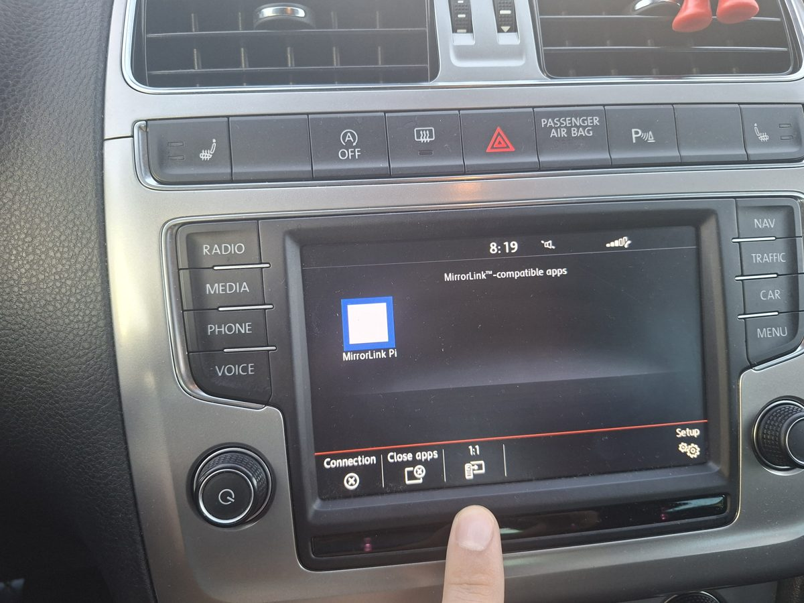
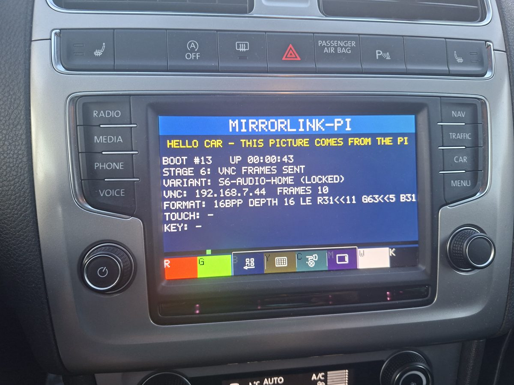
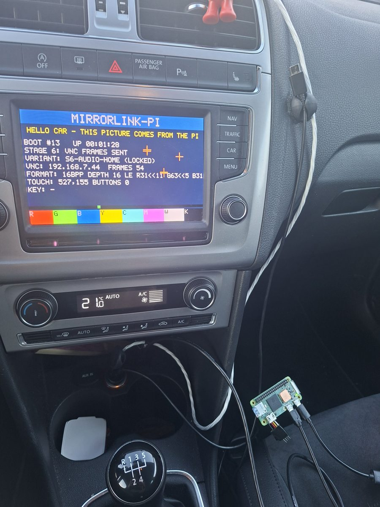
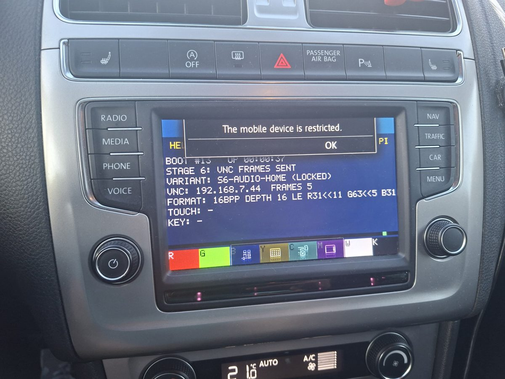

# MirrorLink-Pi

Make a Raspberry Pi Zero 2 W appear as a MirrorLink phone to a car head unit, so the
car displays a screen rendered by the Pi (over VNC, over USB) — and, in **phone mode**,
your Android phone's apps (Google Maps, Spotify, …) on the car's screen, with touch.

**Version 1.0** (2026-10-01): tested end to end with a VW Polo's MIB2 Standard head unit
(`VW-Mibstd2`) and a Samsung Galaxy A56 (Android 16). See [`CHANGELOG.md`](CHANGELOG.md).

## First success — 2026-09-29

A VW Polo's MIB2 Standard head unit (`VW-Mibstd2`) lists the Pi as a MirrorLink app,
launches it and shows the Pi's screen, with touch input coming back to the Pi.

| The car lists the Pi as a MirrorLink app | The Pi's screen on the car's display |
|---|---|
|  |  |
| **Touches reach the Pi (orange crosses), Pi Zero 2 W on the seat** | **Blocked while driving: the Pi is not CCC-certified** |
|  |  |

What made it work: the winning protocol variant is **`s6-audio-home`**. Its app list is
shaped like a real Galaxy S6's (probed with `mlpi probe-phone`, see
[`docs/probe-phone.md`](docs/probe-phone.md)): a VNC home-screen app plus RTP audio
server/client entries for the payload types 98/99 the car announces. With a bare VNC
entry the car stopped right after `GetApplicationList`. Every car trip is an automated
experiment: the Pi records everything and rotates through protocol variants until the
car connects, then locks the winner (see [`docs/field-test.md`](docs/field-test.md)).
The implementation follows the public MirrorLink spec, ETSI TS 103 544 (see
[`docs/spec-notes.md`](docs/spec-notes.md)).

Known limit: while the car is moving, the head unit blocks the picture because the Pi
cannot pass the CCC certification check (device attestation needs a CCC-issued key).

## Legal and safety notice

- **Research project, not a product.** Non-commercial interoperability research on a
  discontinued protocol. No warranty of any kind (see [`LICENSE`](LICENSE)); you use it
  at your own risk.
- **Not affiliated with or endorsed by** the Car Connectivity Consortium (CCC),
  Volkswagen, Samsung or any other company. "MirrorLink" is a trademark of the CCC and
  is used here only to describe what the software is compatible with. MirrorLink-Pi is
  **not MirrorLink-certified** and does not claim to be.
- **Written from the public spec.** The implementation follows the publicly available
  ETSI TS 103 544. The spec itself is not included (`scripts/fetch-spec.sh` downloads
  it for personal reference).
- **No keys, certificates or protection circumvention.** The repository contains no
  CCC or manufacturer keys or certificates, and nothing that defeats device attestation
  or the car's driver-distraction lock. The only certificate is our own self-signed test
  certificate (`config/mlpi-self-signed.crt`).
- **Do not operate it while driving.** The head unit blocks uncertified content while
  the car moves, by design. Test while parked, and do not try to get around that lock.
- **Your car, your responsibility.** Connecting unofficial devices to a vehicle may
  affect its warranty. Captures in this repo have had vehicle identifiers removed
  (`scripts/scrub-captures.py`).
- **Phone mode changes settings on your phone over adb, and that can be risky.** It
  needs Wireless debugging switched on, and the Pi keeps an adb key that grants full
  shell access to the phone: anyone who has the SD card (or the laptop key in
  `~/.config/mlpi/adb/`) and can reach the phone's Wireless debugging port can control
  it. Revoke it any time under *Developer options → Revoke USB debugging
  authorizations*. While connected, the Pi:
  - sets Android's "avoid bad Wi-Fi" (`network_avoid_bad_wifi=1`), which **stays set**
    afterwards (turn off with `avoid_bad_wifi = false`; undo with
    `adb shell settings delete global network_avoid_bad_wifi`);
  - copies the scrcpy server into `/data/local/tmp` (`mlpi-scrcpy-list.jar` stays
    there), creates a virtual display, keeps the phone awake and turns its own screen
    off until the connection ends.

  Use phone mode only with a phone you own, and switch Wireless debugging off when you
  don't need it.

## How it works

Per ETSI TS 103 544 / CCC MirrorLink, the Pi is the *MirrorLink Server* (normally the
phone), the car is the *MirrorLink Client*.

```
[Car head unit] ──USB── [Pi Zero 2 W: CDC-NCM gadget, usb0 = 192.168.7.2]
                          ├── USB vendor request 0xF0 (MirrorLink USB command) → ACK
                          ├── DHCP        (67/udp)   → car gets 192.168.7.44
                          ├── SSDP        (1900/udp) → TmServerDevice:1
                          ├── HTTP/SOAP   (8080)     → descriptor, SCPDs, control, GENA events
                          ├── VNC / RFB   (5900)     → status screen, MirrorLink VNC extensions
                          ├── DAP         (5510)     → honest "attestation not available"
                          ├── pcap + journal + event log → /var/lib/mlpi/sessions/NNNN/
                          └── green LED   → how far the car got (no screen needed)
```

Everything is pure Python standard library on stock Raspberry Pi OS Lite, so the SD
card is prepared completely on the laptop and the Pi never needs internet.

## Phone mode (scrcpy)

The Pi mirrors an Android phone over its own Wi-Fi hotspot with
[scrcpy](https://github.com/Genymobile/scrcpy): the phone renders an 800×480 virtual
display, the Pi decodes it and sends it to the car through the MirrorLink session above,
and car touches go back to the phone. The Pi draws its own launcher with big tiles for
your favourite apps. Internet stays on the phone's mobile data; audio stays on the
phone's Bluetooth link to the car. See [`docs/phone-mode.md`](docs/phone-mode.md).

## Quick start

You need: a **Raspberry Pi Zero 2 W**, a microSD card (8 GB or more), a micro-USB
**data** cable (USB-A or USB-C to micro-USB, to match the car's socket), a **Linux
laptop**, and for phone mode an **Android phone** (Android 11 or newer, for Wireless
debugging).

```bash
# 0. On the laptop, once (Python 3.11+; Debian/Ubuntu package names,
#    Fedora: sudo dnf install android-tools qemu-user-static python3-tkinter):
sudo apt install adb qemu-user-static python3-tk
git clone https://github.com/rsyrnicki/mirror-link-pi && cd mirror-link-pi
# 1. Flash Raspberry Pi OS Lite (64-bit) with Raspberry Pi Imager (set a user),
#    then take the card out and put it back in.
# 2. Phone mode only: pair the phone with the Pi's key (phone + laptop on home Wi-Fi):
PYTHONPATH=src python3 -m mlpi pair-phone
# 3. Install onto the card: --phone adds phone mode, --ssh allows updates over USB later,
#    --data-partition protects the card against power cuts (freshly flashed cards only):
lsblk                                         # find the card, e.g. /dev/sdb
sudo ./scripts/prepare-sd.sh --phone --ssh --data-partition /dev/sdX
# 4. Pre-flight at home: card in the Pi, Pi's USB port → laptop, wait for 2 LED blinks:
PYTHONPATH=src python3 -m mlpi simulate-car --target 192.168.7.2
PYTHONPATH=src python3 -m mlpi car-view       # live window, like the car's screen
# 5. Car: plug the Pi into the car's USB socket, open "MirrorLink Pi" on the head unit.
# 6. Back home, if something went wrong:
sudo ./scripts/collect-logs.sh /dev/sdX
# Later updates without taking the card out (card prepared with --ssh, Pi on USB):
./scripts/update-pi.sh <pi-user>@192.168.7.2
```

Step by step, with what to expect at each point:
[`docs/pi-deployment.md`](docs/pi-deployment.md) (SD card),
[`docs/phone-mode.md`](docs/phone-mode.md) (phone setup and use),
[`docs/field-test.md`](docs/field-test.md) (pre-flight and the car).

Tested cars and phones, and how to add yours:
[`docs/compatibility.md`](docs/compatibility.md).

More: [`docs/laptop-dev.md`](docs/laptop-dev.md) (development and tests),
[`docs/spec-notes.md`](docs/spec-notes.md) (the MirrorLink spec, clause by clause),
[`docs/probe-phone.md`](docs/probe-phone.md) (measuring a real MirrorLink phone),
[`docs/known-gaps.md`](docs/known-gaps.md) (what we know we don't know).

## Repo layout

| Path | What |
|---|---|
| `src/mlpi/` | the server: `dhcp`, `ssdp`, `http_descriptor` + `soap` + `eventing`, `rfb` + `mirrorlink_vnc` + `canvas` + `screen`, `dap`, `variants`, `session`, `capture`, `gadget`, `led`, `runner`; phone mode: `phone` (scrcpy client), `avdecode` (H.264 via libavcodec), `video` (frames + source switch) |
| `src/mlpi/tools/` | `simulate_car` (recorded VW handshake + VNC client), `car_view` (live window that behaves like the car), `probe_phone` (drive a real phone), `phone_tools` (`pair-phone`, `phone-preview`), `report`, `discover` |
| `config/` | device descriptor template, SCPDs, `variants.toml`, `mlpi.toml.example` |
| `systemd/` | units started at boot on the Pi |
| `scripts/` | `prepare-sd.sh`, `collect-logs.sh`, `fetch-spec.sh`, `fetch-scrcpy-server.sh` (laptop); `probe-sai-*` (VW SAI research) |
| `captures/` | car captures from earlier sessions (vehicle identifiers scrubbed) |
| `legacy/` | Robert's original files, kept for git-blame lineage |

## License

GPL-3.0 — see [`LICENSE`](LICENSE). Carried from Robert's original repo at https://github.com/rsyrnicki/mirror-link-pi.
Provided "as is", without warranty; see the Legal and safety notice above. Trademarks
belong to their owners.
